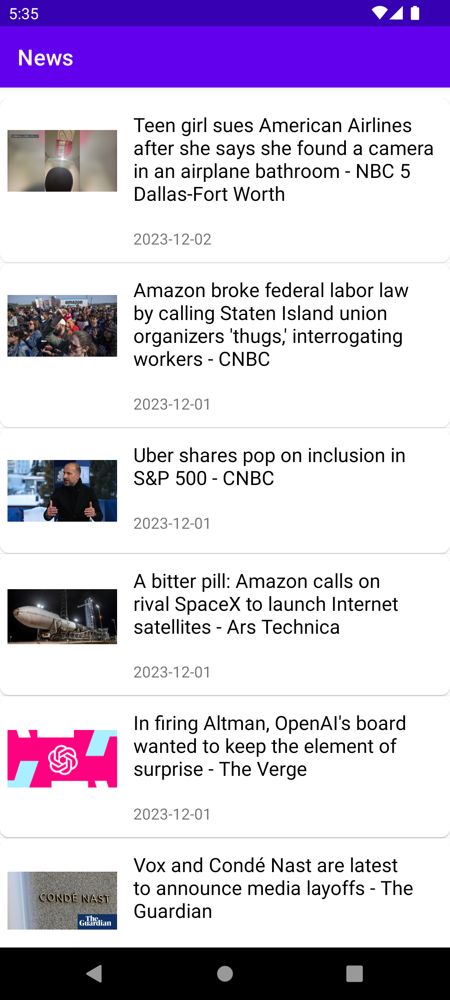

# News App

This is a native android app based on newsapi.org built using MVP architecture to display a list of news articles and news details on selecting an interested news article.

## Features

- Displays a list of News Articles with thumbnail
- When user reaches bottom of the list, more news items are automatically loaded using recycler view pagination
- On selecting a news article, the user can view more details about the news and navigate to the    original news article
- If news list or news details are not available at anytime, a popup dialog is displayed informing the user about the same.

## Screenshots

## TechStack

- Kotlin
- Android SDK
- XML
- Dagger
- RxJava
- Retrofit
- Glide

